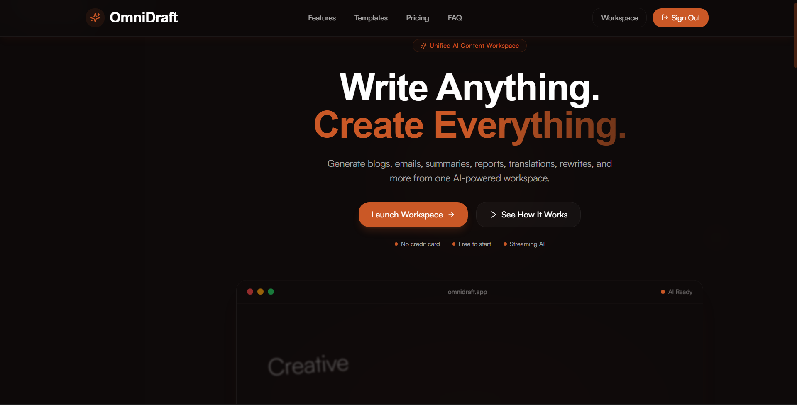
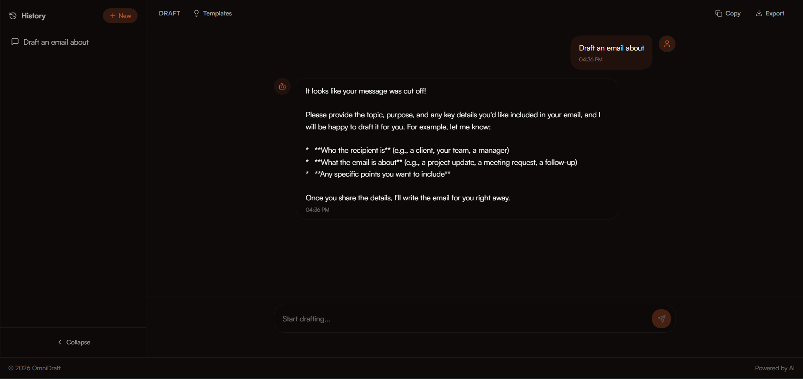

<p align="center">
  
</p>

<h1 align="center">OmniDraft</h1>

<p align="center">
  <strong>AI-Powered Content Creation Workspace</strong><br>
  From rough idea to polished draft — one workspace.
</p>

<p align="center">
  
  
  
  
  
  
  
  
  
</p>

---

## Live Demo

<p align="center">
  <a href="https://omni-draft.duckdns.org">
    
  </a>
</p>

**HTTPS:** [https://omni-draft.duckdns.org](https://omni-draft.duckdns.org)

---

## Screenshots

### Landing Page



### Workspace



---

## Core Features

| # | Feature | Description |
|---|---------|-------------|
| ✅ | **AI Drafting** | Generate professional emails, blog posts, and documents |
| ✅ | **Document Summarization** | Upload PDFs or paste text for instant AI summaries |
| ✅ | **Creative Writing** | Stories, poems, and creative content generation |
| ✅ | **Real-time Streaming** | SSE-powered token-by-token response rendering |
| ✅ | **Three-Mode Wheel** | Switch instantly between Draft / Summarize / Creative |
| ✅ | **Pre-built Templates** | 12 curated prompts per mode (email, blog, story, etc.) |
| ✅ | **Conversation History** | Saved sessions per user, persisted in PostgreSQL |
| ✅ | **User Authentication** | Magic link auth via Supabase |
| ✅ | **Export Conversations** | Download as TXT or Markdown |
| ✅ | **Copy to Clipboard** | One-click copy on generated content |
| ✅ | **File Upload** | Upload PDF/text for Summarize mode |
| ✅ | **Dark Mode** | OLED-optimized dark theme |
| ✅ | **Dockerized** | Multi-stage Docker build with nginx |
| ✅ | **AWS Ready** | Deployed on Elastic Beanstalk with Let's Encrypt HTTPS |

---

## Tech Stack

| Layer | Technology |
|-------|-----------|
| **Frontend** | React 18 + Vite + TypeScript + Tailwind CSS v3 |
| **Animations** | Framer Motion |
| **Backend** | Python FastAPI + Uvicorn |
| **AI / LLM** | NVIDIA API (Nemotron) + httpx async streaming |
| **Streaming** | Server-Sent Events (SSE) |
| **Auth** | Supabase Auth (magic link) |
| **Database** | Supabase PostgreSQL (conversations, messages, templates) |
| **File Storage** | Supabase Storage (S3-compatible) |
| **Rate Limiting** | slowapi (20 req/min per IP) |
| **Container** | Docker multi-stage build |
| **Reverse Proxy** | Nginx |
| **Deployment** | AWS Elastic Beanstalk (t3.micro) |
| **Registry** | Amazon ECR |

---

## Architecture

```
                    ┌─────────────────────────────┐
                    │    Browser (React + Vite)    │
                    │  Landing · Workspace · Auth  │
                    └──────────────┬──────────────┘
                                   │
                          HTTPS (fetch / EventSource)
                                   │
                    ┌──────────────▼──────────────┐
                    │    Nginx Reverse Proxy      │
                    │         (port 8080)         │
                    └──────────────┬──────────────┘
                                   │
                    ┌──────────────▼──────────────┐
                    │      FastAPI (Uvicorn)      │
                    │   ┌─────────────────────┐   │
                    │   │ SSE Streaming       │   │
                    │   │ Auth Middleware     │   │
                    │   │ Rate Limiter       │   │
                    │   │ File Upload        │   │
                    │   └─────────────────────┘   │
                    └──┬──────────────┬───────────┘
                       │              │
        ┌──────────────▼──┐    ┌──────▼──────────┐
        │    Supabase     │    │   NVIDIA API    │
        │  ┌───────────┐  │    │  (Nemotron)     │
        │  │ PostgreSQL│  │    │  SSE Streaming  │
        │  │ Auth      │  │    └─────────────────┘
        │  │ Storage   │  │
        │  └───────────┘  │
        └─────────────────┘
```

---

## Project Workflow

```
User → React Frontend → FastAPI Backend → NVIDIA LLM → Streaming Response
                                                     ↓
                                              Conversation Saved
                                                     ↓
                                              Supabase Database
```

---

## Getting Started

```bash
# Clone
git clone https://github.com/amalbyte-afk/OmniDraft.git
cd OmniDraft

# Install frontend
npm install

# Install backend
cd backend
pip install -r requirements.txt
cd ..

# Set up environment
cp .env.example .env
cp backend/.env.example backend/.env
# Edit .env with your Supabase and NVIDIA API keys

# Run with Docker
docker compose up

# Or run manually:
# Terminal 1 (backend):
cd backend && uvicorn app.main:app --reload --port 8000
# Terminal 2 (frontend):
npm run dev
```

---

## Project Structure

```
OmniDraft/
├── src/                  # React frontend (Vite + Tailwind)
│   ├── components/       # UI, layout, chat, wheel, templates
│   ├── pages/            # Home, Workspace, Auth, History, Settings
│   ├── hooks/            # useAuth, useStreamingChat, useConversations
│   └── lib/              # Supabase client, API client
├── backend/              # FastAPI backend
│   ├── app/
│   │   ├── routers/      # auth, chat, conversations, export, templates
│   │   ├── services/     # LLM, Supabase DB, rate limiting
│   │   ├── models/       # Pydantic schemas
│   │   └── middleware/   # JWT verification
│   └── tests/            # Pytest test suite
├── docker/               # Dockerfile, nginx.conf, entrypoint
├── prompts/              # Vibe coding prompt history
├── assets/               # Banner, screenshots
├── supabase/             # SQL migrations
├── OMNIDRAFT-SPEC.md     # Full project specification
├── DEPLOYMENT.md         # AWS deployment guide
├── Dockerrun.aws.json    # Elastic Beanstalk config
└── docker-compose.yml    # Local development
```

---

## Environment Variables

| Variable | Description | Required |
|----------|-------------|----------|
| `SUPABASE_URL` | Supabase project URL | ✅ |
| `SUPABASE_SERVICE_KEY` | Supabase service role key | ✅ |
| `SUPABASE_ANON_KEY` | Supabase anon/publishable key | ✅ |
| `NVIDIA_API_KEY` | NVIDIA LLM API key | ✅ |
| `NVIDIA_MODEL` | Model ID (e.g. `z-ai/glm-5.2`) | ✅ |
| `ALLOWED_ORIGINS` | Comma-separated CORS origins | ✅ |
| `DUCK_TOKEN` | DuckDNS API token for HTTPS automation | |
| `RATE_LIMIT` | Rate limit (e.g. `20/minute`) | |
| `MAX_TOKENS` | Max response tokens | |
| `LOG_LEVEL` | Logging level (`INFO`, `DEBUG`) | |

---

## Roadmap

- [x] AI Chat with 3 modes (Draft / Summarize / Creative)
- [x] User authentication (magic link)
- [x] Conversation history
- [x] Docker multi-stage build
- [x] AWS deployment (Elastic Beanstalk)
- [x] SSE real-time streaming
- [x] File upload for summarization
- [x] Copy to clipboard & export (TXT/MD)
- [ ] Voice input (Web Speech API)
- [ ] RAG mode (pgvector embeddings)
- [ ] Team workspaces & sharing
- [ ] Custom user templates
- [ ] Admin analytics dashboard

---

## Documentation

| Document | Description |
|----------|-------------|
| [`OMNIDRAFT-SPEC.md`](OMNIDRAFT-SPEC.md) | Full project specification, design tokens, API structure |
| [`DEPLOYMENT.md`](DEPLOYMENT.md) | AWS deployment guide and architecture |
| [`prompts/`](prompts/) | Complete prompt engineering history |
| [`OmniDraft-Project-Report.pdf`](OmniDraft-Project-Report.pdf) | Final project report &amp; concept note |

---

## Project Statistics

| Frontend | Backend | Infrastructure |
|----------|---------|---------------|
| React 18 | Python 3.11 | Docker |
| TypeScript | FastAPI | AWS Elastic Beanstalk |
| Vite | Uvicorn | Amazon ECR |
| Tailwind CSS v3 | httpx (async) | Nginx |
| Framer Motion | Supabase SDK | Let's Encrypt |
| Zustand (state) | Pydantic v2 | GitHub |

---

## Acknowledgements

- [React](https://react.dev) — UI framework
- [FastAPI](https://fastapi.tiangolo.com) — Python backend
- [Supabase](https://supabase.com) — Auth, database, and storage
- [NVIDIA](https://build.nvidia.com) — LLM API
- [Tailwind CSS](https://tailwindcss.com) — Styling
- [Framer Motion](https://framer.com/motion) — Animations
- [Docker](https://docker.com) — Containerization
- [AWS](https://aws.amazon.com) — Cloud deployment

---

## License

**MIT** — See [LICENSE](LICENSE) for details.

---

## Author

<p align="center">
  <strong>Amal Chandran</strong><br>
  <a href="https://github.com/amalbyte-afk">GitHub</a>
</p>
