<p align="center">
  
</p>

# OmniDraft

AI-powered content creation platform built with React, FastAPI, Supabase, Docker, and AWS.

> From rough idea to polished draft — one workspace.

## Badges


## Demo

**Live URL**: [http://omnidraft-prod.eba-pepktrup.us-east-1.elasticbeanstalk.com](http://omnidraft-prod.eba-pepktrup.us-east-1.elasticbeanstalk.com)

## Features

- **AI Drafting** — Generate professional emails, blog posts, and documents
- **Document Summarization** — Upload PDFs or paste text for instant summaries
- **Creative Writing** — Stories, poems, and creative content generation
- **Real-time Streaming** — SSE-powered token-by-token response rendering
- **Three-Mode Wheel** — Switch between Draft / Summarize / Creative instantly
- **Pre-built Templates** — 12 curated prompts per mode (email, blog, summary, story, etc.)
- **Conversation History** — Saved sessions per user, persisted in PostgreSQL
- **User Authentication** — Magic link auth via Supabase
- **Export & Copy** — Download as TXT / Markdown or copy to clipboard

## Tech Stack

| Frontend | Backend | Database | Deployment |
|----------|---------|----------|------------|
| React 18 | Python FastAPI | Supabase PostgreSQL | AWS Elastic Beanstalk |
| Vite | Uvicorn | Supabase Auth | Docker (multi-stage) |
| Tailwind CSS v3 | NVIDIA LLM API | Row-Level Security | Nginx reverse proxy |
| Framer Motion | Server-Sent Events | 4 tables + RLS | ECR + EC2 |

## Architecture

```
Browser (React + Vite)
  │
  │ HTTPS (fetch / EventSource)
  ▼
Nginx Reverse Proxy (port 8080)
  │
  ├── /api/* → FastAPI (port 8000)
  │              │
  │              ├── Supabase (PostgreSQL + Auth)
  │              └── NVIDIA API (LLM + SSE streaming)
  │
  └── /* → Static files (React build)
```

## Getting Started

```bash
# Clone the repo
git clone https://github.com/amalbyte-afk/OmniDraft.git
cd OmniDraft

# Install frontend dependencies
npm install

# Install backend dependencies
cd backend
pip install -r requirements.txt
cd ..

# Copy environment variables
cp .env.example .env
cp backend/.env.example backend/.env

# Start with Docker
docker compose up

# Or run locally:
# Terminal 1: backend
cd backend && uvicorn app.main:app --reload --port 8000
# Terminal 2: frontend
npm run dev
```

## Project Structure

```
OmniDraft/
├── src/             # React frontend (Vite + Tailwind)
├── backend/         # FastAPI backend (routers, services, models)
├── docker/          # Dockerfile, nginx config, entrypoint
├── prompts/         # Vibe coding prompt history
├── assets/          # Images and screenshots
├── supabase/        # SQL migrations
└── ...
```

## Environment Variables

| Variable | Description |
|----------|-------------|
| `SUPABASE_URL` | Supabase project URL |
| `SUPABASE_SERVICE_KEY` | Supabase service role key |
| `NVIDIA_API_KEY` | NVIDIA LLM API key |
| `NVIDIA_MODEL` | Model ID (e.g. `z-ai/glm-5.2`) |
| `ALLOWED_ORIGINS` | Comma-separated allowed CORS origins |
| `RATE_LIMIT` | Rate limit (e.g. `20/minute`) |
| `MAX_TOKENS` | Max response tokens |
| `LOG_LEVEL` | Logging level |

## Roadmap

- [x] AI Chat with 3 modes (Draft / Summarize / Creative)
- [x] User authentication (magic link)
- [x] Conversation history
- [x] Docker multi-stage build
- [x] AWS deployment (Elastic Beanstalk)
- [x] SSE streaming
- [x] File upload (Summarize mode)
- [ ] Voice input
- [ ] RAG mode (pgvector)
- [ ] Team workspaces
- [ ] Custom templates

## License

MIT

## Author

Developed by [Amal Chandran](https://github.com/amalbyte-afk)
